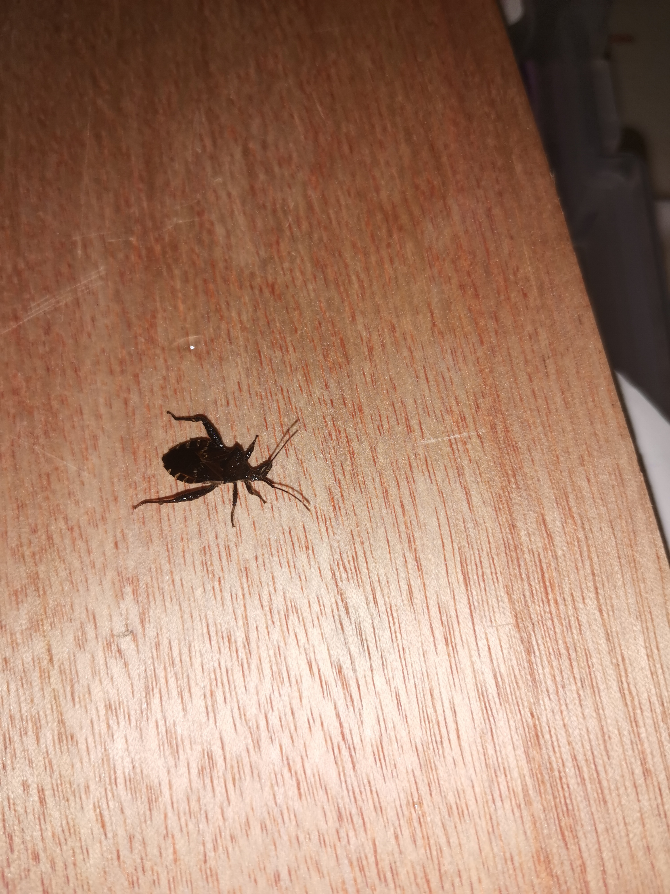
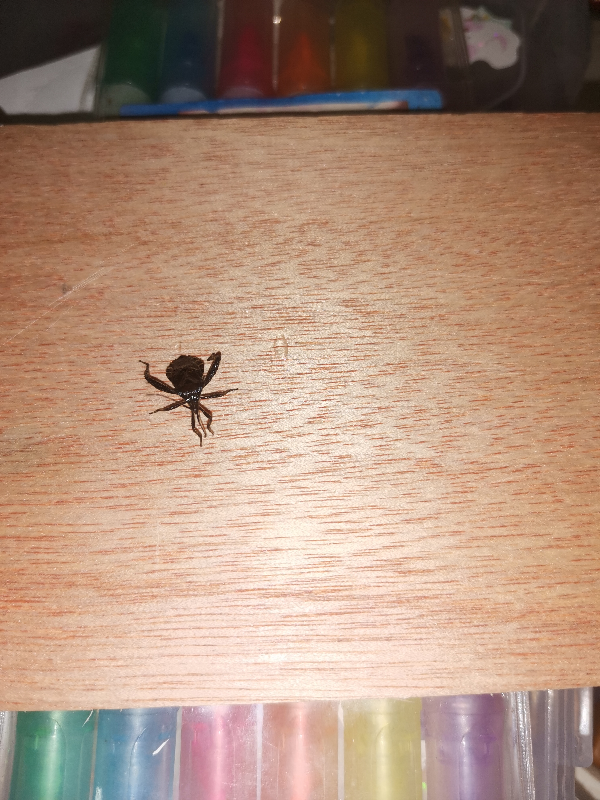
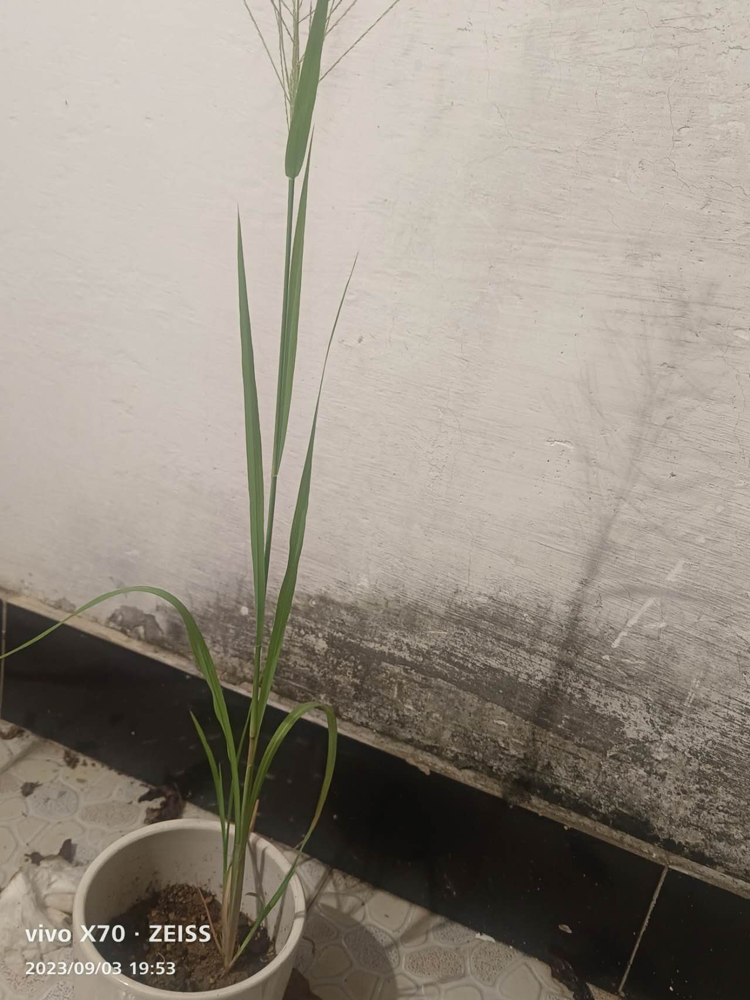
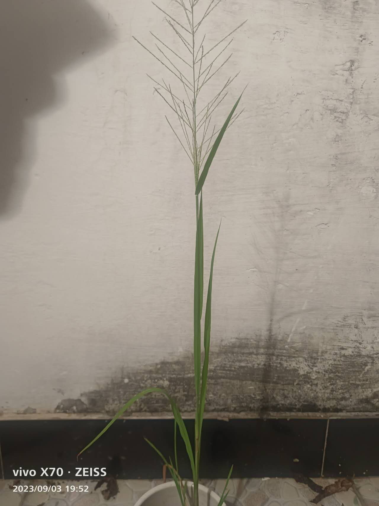

## 8.30

8月30日晚上，我哥哥捉到了一个不知名的虫子。我们看到他从上爬到下，从下跑到上还会飞呢！他爬来爬去的样子，看起来很活泼又可爱。他有三对足，一对触角，一对翅膀。它是黑色的，上面看起来像枯树叶似的，下面呢，是白白的。她的脚看起来很强壮，力气却很小呢！他那两根枯树枝一样的触角，倒映在桌上。

## 9.1

9月1日下午，我看到一群蚂蚁正在搬运东西，就好奇的看了一下。
一只只蚂蚁都卖力的搬着粮食，一只蚂蚁在前方引导着大家。
我心里想，蚂蚁们真伟大呀，为了蚁后这么努力。他们肯定想要更多工资（食物）！！！
观察了好一段时间，发现一只蚂蚁的腿断了，但是还是坚持住了。他们一步一步的向前走，也慢慢的到了巢穴。

## 9.3

9月3日晚上，我观察了一株狗尾巴草。它的来历是，我拿了一个菜种子，不过它长出了狗尾巴草，哥哥觉得，是那个，狗尾巴草的种子飘了过来，把菜种的生命夺走了。上半部分，像一株嫩绿色的松树，树枝摸起来软软的，又像一颗麦子。下部分，像一根没有葱味的葱。又像一韭菜。下半身，叶子边缘摸起来刺刺的，上半部分，摸起来很舒服。

